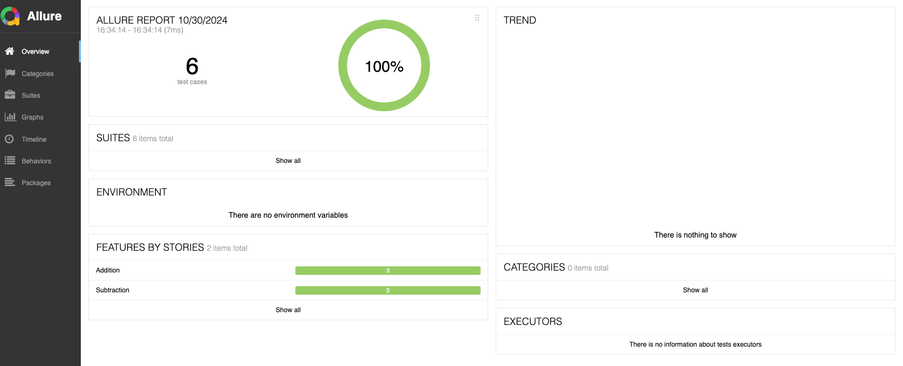
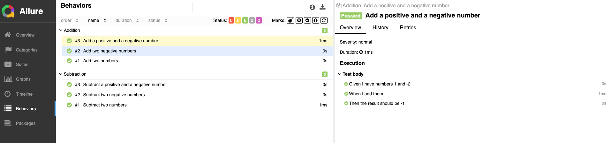
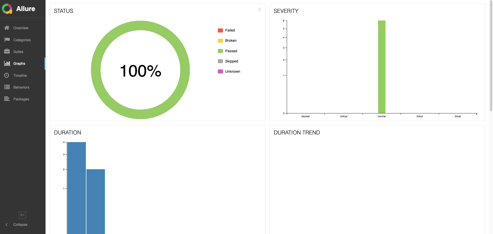

# Jenkins BDD on Docker

## Overview
This project is a Jenkins-based setup for running BDD tests on dedicated Container using Behave and generating Allure reports.

## Prerequisites
- Docker
- Docker Compose

## Setup

1. **Clone the repository:**

2. **Build and run the Docker containers:**
    ```sh
    docker-compose up --build
    ```

## Running Tests
The tests will automatically run when the Jenkins container starts. The results will be saved in the `allure-report` directory.

## Viewing Allure Report
To view the generated Allure report, you need to have Allure installed on your local machine. Follow the installation instructions [here]([https://allure-report.readthedocs.io/en/latest/](https://allurereport.org/docs/install/)).

Once Allure is installed, you can serve the report by running:
```sh
allure serve <path_to_your_my_/jenkins/allure-report> 
```

Example allure report:


Example allure Behaviors with BDD tests:


Example allure Graphs:

